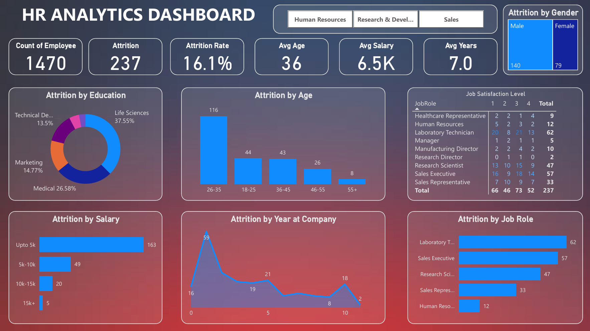

## 📌 Project Overview
This Power BI project visualizes key metrics related to employee attrition, enabling HR teams to make data-driven decisions.  
The dashboard provides insights into employee demographics, job satisfaction, and attrition patterns to help identify areas for improving retention strategies.

## 🛠 Tools & Technologies
- **Power BI** – Data visualization and dashboard creation
- **Excel / CSV** – Data source for employee records
- **DAX** – Measures and calculated columns for analysis

## 📊 Dashboard Features
- **Overall KPIs**:
  - Total Employees
  - Attrition Count
  - Attrition Rate
  - Average Age
  - Average Salary
  - Average Years at Company
- **Attrition Analysis**:
  - By Education Field
  - By Age Group
  - By Salary Range
  - By Years at Company
  - By Job Role
  - By Gender
- **Job Satisfaction Levels** segmented by Job Role

## 📈 Key Insights
- The **26–35 age group** shows the highest attrition.
- Most attrition occurs in the **Life Sciences** and **Medical** education fields.
- Employees with salaries **up to 5K** have the highest attrition rates.
- Laboratory Technicians and Sales Executives experience significant turnover.

